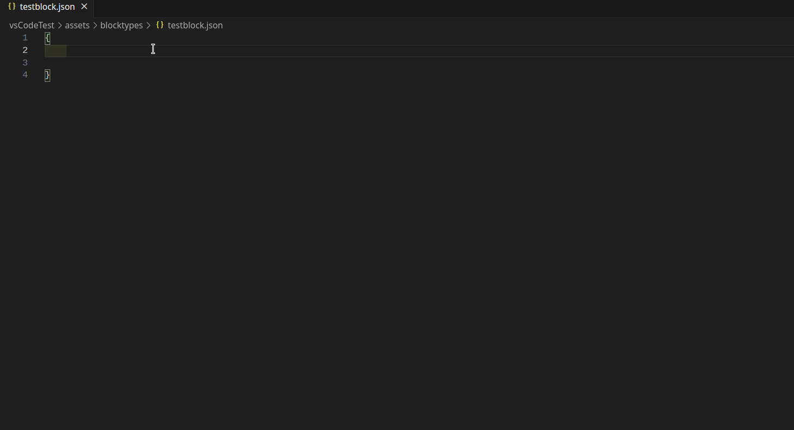
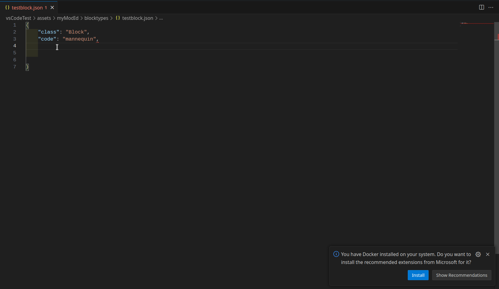
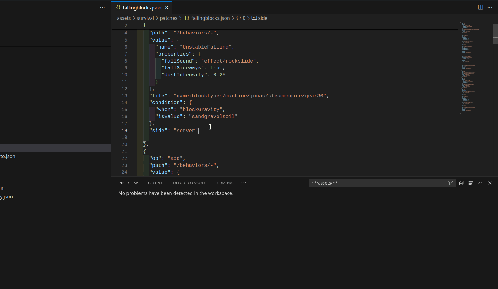
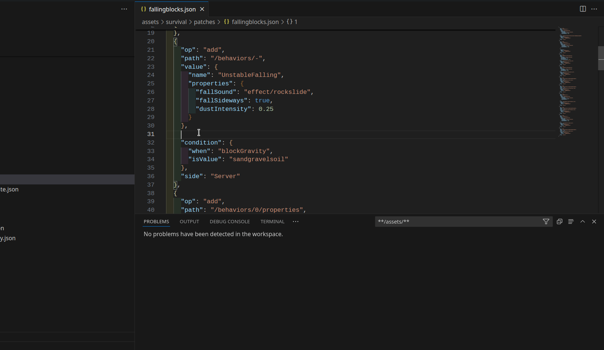

# Features

For detailed version history, see the [Changelog](CHANGELOG.md)
- 38 JSON Schemas covering key asset types: `entities`, `blocks`, `items`.
- Full support for complex elements like attributes, behaviors, classes, codes, and entity behaviors.
- JsonPatches have autocomplete for different operations and paths

## How to use

To properly integrate the JSON Schemas, make sure to create the correct subfolders in your mod directory. Key folder structures include:

- `**/assets/<modid>/blocktypes/**`
- `**/assets/<modid>/entities/**`
- `**/assets/<modid>/itemtypes/**`

For example, if your mod ID is `mymod`, a correct path for blocktypes would look like:

- `assets/mymod/blocktypes/my_block.json`

For certain files, the name must match exactly, such as:

- `assets/mymod/config/weather.json`

For more detailed file matches and examples, refer to `SchemaReleases/current/vs_schema_catalog.json`.

# Installation

## Visual Studio 2022:
### Manual
`Tools>Options>TextEditor>Json>Schema`
Then click add new one in the upper right.
Copy this link:
####
    https://raw.githubusercontent.com/SirNoName2705/VintelliSchemas/master/SchemaReleases/current/vs_schema_catalog.json
and paste it in the settings.

### Extension
As of right now it does not seem to be possible to make an Extension for VS2022. If you have experience in developing such extensions just write me in discord. All help is much appreciated.

## Rider
### Extension
You can use the extension it also automatically updates your schemas.
If you ever have no internet connection it also saves them locally.
[Install Vscatalog from JetBrains Marketplace](https://plugins.jetbrains.com/plugin/25365-vscatalog)

### Manual
- Download the JsonSchemas.xml [here](https://raw.githubusercontent.com/SirNoName2705/VintelliSchemas/master/SchemaReleases/current/jsonSchemas.xml)
- Click save as and keep file name
- Then put it in the .idea/.idea.__ProjectName__.dir/.idea folder (that is the .idea folder of the project not the solution)
- In this repo it would be [here](https://github.com/SirNoName2705/VintelliSchemas/tree/master/.idea/.idea.VintelliSchemas/.idea) you can even copy that file
- If you use the local version you also need to put the .schemas folder in the main directory

## VsCode
### Extension
Hit `Ctrl + P` and paste `ext install Neurosoft.vscatalog`  
Or just search for vintage story in vs code extensions you will find the vscatalog extension quickly.
### Manual
- Download the settings.json [here](https://raw.githubusercontent.com/SirNoName2705/VintelliSchemas/master/SchemaReleases/current/settings.json)
- Click save as and keep file name
- Put the file in your .vscode folder
- If you use the local version you also need to put the .schemas folder in the main directory

### Todo
- Add example images
- Add Roadmap
- Add to Vintage Story mod template
- Write Vintage Story wiki entry

#### Credits:
- DarkhNekromant for the idea and a lot of the code.
- Th3Dilli for helping me to understand vintage story